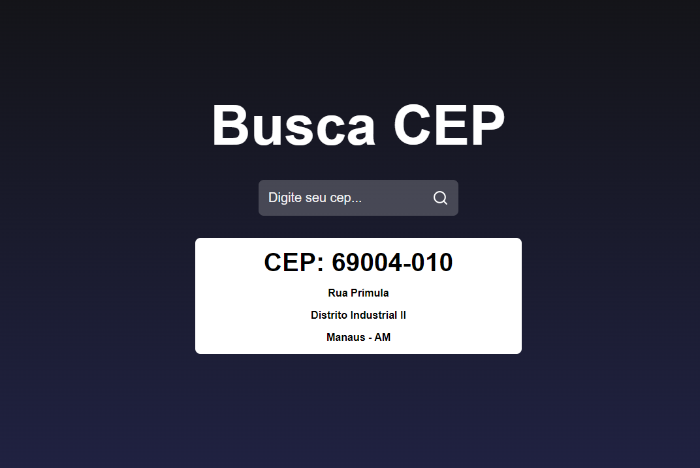

# 🔍 Busca de CEP

Bem-vindo ao repositório do **Busca de CEP**! 🚀

Este projeto é um site de busca de CEPs, desenvolvido utilizando **HTML**, **CSS** e **React**. Ele consome uma API RESTful para fornecer informações precisas e rápidas sobre os CEPs pesquisados. Com uma interface intuitiva e amigável, este site facilita a busca por endereços completos a partir de um CEP específico.

<a href="https://alysxn.github.io/Buscador-CEP/">Clique aqui para entrar no site!</a>

## Imagens do Projeto

## ✨ Funcionalidades

- **Busca Rápida:** Obtenha informações completas sobre o endereço com base no CEP.
- **Interface Responsiva:** Layout adaptável para diferentes dispositivos, proporcionando uma experiência de usuário consistente.
- **Consumo de API RESTful:** Integração com API para garantir dados atualizados e precisos.
- **Validação de Entrada:** O campo de busca aceita apenas números, garantindo que as entradas sejam válidas.

## 🚀 Tecnologias Utilizadas

- **HTML5**
- **CSS3**
- **React**
- **API RESTful**
